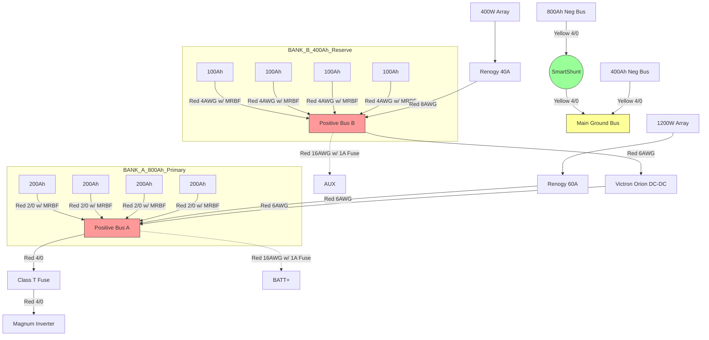

# solarplan
boatsolarbattery update
For a 10-foot run transiting bilges, you must use **UL 1426 Tinned Copper Marine Grade Cable**. Unlike standard automotive or residential wire, tinned copper resists the "green death" (corrosion) common in high-humidity bilges, and the insulation is rated for oil, fuel, and acid resistance.

Here is your updated documentation in GitHub-style Markdown.

# 🚢 Project: 1.2kA Marine Solar & Split-Farm Battery Upgrade

## 🛒 Updated Procurement List

*Prices are estimated based on current Amazon Marine-Grade averages.*

| Item | Specification | Recommendation |
| --- | --- | --- |
| **Victron Orion-Tr Smart** | 12/12-30A Non-Isolated | [Amazon - Victron Orion 12/12-30](https://www.google.com/search?q=https://www.amazon.com/Victron-Orion-Tr-12-Volt-30-amp-360-Watt/dp/B07Z4G6Z66) |
| **Class T Fuse Block** | For 4/0 Cable (Magnum) | [Blue Sea 5502100](https://www.google.com/search?q=https://www.amazon.com/Blue-Sea-Systems-5502100-Insulating/dp/B001V7X712) |
| **Class T Fuse** | 300A or 400A Rating | [Blue Sea 5121](https://www.google.com/search?q=https://www.amazon.com/Blue-Sea-Systems-5121-Class/dp/B000K2K7TC) |
| **Primary Cable** | **4/0 AWG** UL 1426 Tinned Copper | [Ancor 4/0 Marine Cable Red/Black](https://www.google.com/search?q=https://www.amazon.com/Ancor-Marine-Grade-Battery-Cable/dp/B000NV2D06) |
| **Bridge/MPPT Wire** | **6 AWG** UL 1426 (Duplex) | [Ancor 6/2 Marine Duplex](https://www.google.com/search?q=https://www.amazon.com/Ancor-Marine-Grade-Duplex-Cable/dp/B000NY8E1I) |
| **Small Gauge Wire** | **16 AWG** (For Shunt Aux/Batt+) | [Ancor 16 AWG Red with 1A Fuse](https://www.google.com/search?q=https://www.amazon.com/Ancor-Marine-Grade-Primary-Wire/dp/B000NV000) |
| **Conduit/Loom** | Slit Sealtite or Braided Loom | [1" Braided Cable Sleeve](https://www.google.com/search?q=https://www.amazon.com/1-inch-Braided-Cable-Sleeve/dp/B074LRSL3P) |

---

## 📐 Final Schematic (Color Coded)

---

## ✅ Step-by-Step Installation Checklist

### **1. Bilge Transit Standards**

* [ ] **Wire Choice:** Ensure all 10ft runs are **UL 1426 Tinned Copper**.
* [ ] **Protection:** Use split-loom or conduit for all wires passing through the bilge to prevent physical chafe against the hull/bulkheads.
* [ ] **Support:** Secure cables every 18 inches using UV-rated cable ties or rubber-lined P-clamps.
* [ ] **Height:** Route cables as high as possible in the bilge to avoid permanent immersion in standing water.

### **2. Bank A & B Setup**

* [ ] Install **MRBF Terminal Fuses** on every battery positive post.
* [ ] Connect battery banks in parallel to their respective bus bars using the diagonal method (Pos on Batt 1, Neg on Batt 4).

### **3. The Monitoring Brain**

* [ ] Connect **SmartShunt** between the 800Ah Negative Bus and the Main Ship Ground.
* [ ] Plug Red wire into **BATT+** on shunt; connect to 800Ah Positive Bus.
* [ ] Plug Red wire into **AUX** on shunt; connect to 400Ah Positive Bus.

---

## ⚙️ Programming Instructions

### **Victron Orion-Tr Smart (Bridge Settings)**

1. Open **VictronConnect** App via Bluetooth.
2. Select **Settings** (Gear Icon) -> **Battery Settings**.
3. **Charger Mode:** Must be toggled **ON**.
4. **Battery Preset:** Select "User Defined."
* **Absorption Voltage:** 14.2V
* **Float Voltage:** 13.5V
* **Bulk Current Limit:** 30A

5. **Engine Shutdown Detection:** Toggle **OFF** (this is critical—since you aren't connected to an alternator, "smart" detection will prevent it from turning on).
6. **Input Voltage Lock-out:** Set "Shut down" to **13.0V** and "Restart" to **13.3V**. This ensures Bank B only helps Bank A when Bank B has plenty of solar coming in.

---

## 🧪 Final Test Plan (Check-Off)

* [ ] **Static Voltage Test:** Bank A and Bank B should be within 0.2V of each other before the Orion is turned on.
* [ ] **The "Hand-Touch" Test:** Under full solar load (1600W combined), feel the terminal fuses. If they are hot, the connection is loose.
* [ ] **Voltage Drop Check:** Under 30A load (Orion running), measure voltage at Bank B bus bar and then at Orion Input. Difference should be **< 0.2V**. (If higher, your 6AWG crimps are poor).
* [ ] **App Verification:** Open VictronConnect. Ensure "Main Voltage" matches Bank A and "Aux Voltage" matches Bank B.
